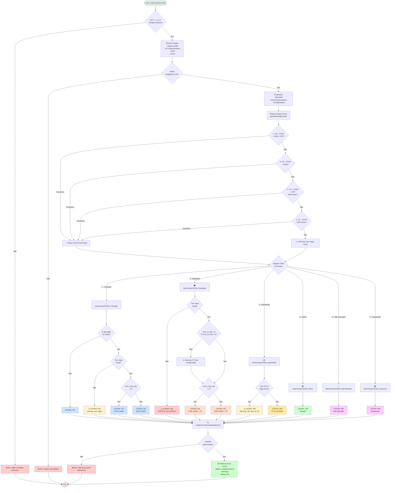

LEGENDA:
- 🔵 Azul claro = CSOSN 101/102 (Tributado normal)
- 🟠 Laranja = CSOSN 201/202 (Substituto com ST)
- 🟡 Amarelo = CSOSN 500 (Substituído)
- 🟢 Verde = CSOSN 103 (Isento)
- 🔴 Rosa = CSOSN 400 (Não tributado/Suspensão)
- ⚠️ Amarelo claro = Warnings
- ❌ Vermelho = Erros
